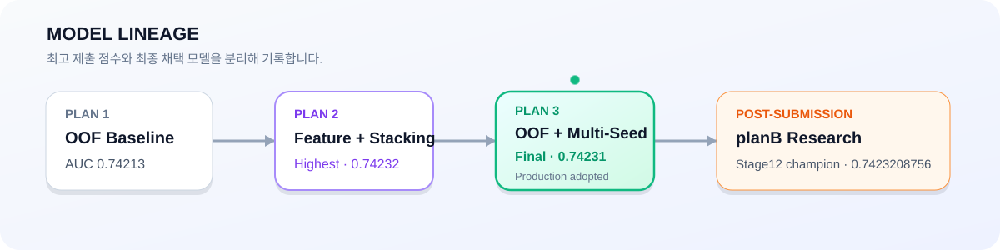
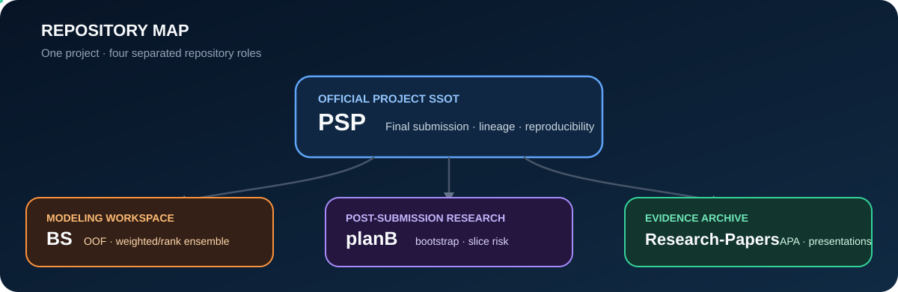

<a id="top"></a>

<p align="center">
  <a href="#project" aria-label="프로젝트 소개로 이동">
    
  </a>
</p>

<h1 align="center">난임걱정마삼조</h1>

<p align="center">
  <strong>난임 환자 대상 임신 성공 여부 예측 AI 프로젝트</strong><br />
  임상·시술 데이터의 구조를 해석하고, OOF 검증과 앙상블을 통해 임신 성공 확률을 예측합니다.
</p>

<p align="center">
  
  
  
  
</p>

<p align="center">
  <a href="#project">Project</a> ·
  <a href="#result">Final Result</a> ·
  <a href="#lineage">Model Lineage</a> ·
  <a href="#research">Research</a> ·
  <a href="#repositories">Repositories</a> ·
  <a href="#principles">Principles</a>
</p>

---

<a id="project"></a>

## 🧬 Project

이 프로젝트는 난임 시술 데이터를 바탕으로 **임신 성공 여부를 예측하는 ROC-AUC 기반 이진 분류 문제**를 다룹니다.

단순히 모델을 바꾸는 데 그치지 않고, 실제 시술 과정을 반영하는 데이터 구조를 이해한 뒤 그 신호를 모델링하는 방향으로 연구했습니다.

| Clinical signals | Modeling | Validation |
|---|---|---|
| 연령, 시술 유형, 난자·배아·이식 정보, 과거 시술 이력 | CatBoost · LightGBM · XGBoost · Ensemble | K-Fold OOF · Multi-Seed · 제출 결과 · 후속 강건성 검증 |

특히 DI 시술에서 배아·난자·이식 관련 정보가 함께 비는 패턴을 단순 누락이 아니라 **시술 과정에 따른 구조적 결측**으로 해석하고, 원본 NaN의 의미를 보존하면서 필요한 missing signal을 활용했습니다.

---

<a id="result"></a>

## 🏆 Final Result

최종 발표에서는 **최고 제출 점수**와 **최종 채택 Production 모델**을 구분했습니다.

| 항목 | 결과 |
|---|---:|
| 평가 지표 | ROC-AUC |
| 1안 | OOF 기반 기초 성능 수립 · 제출 `0.74213` |
| 2안 | Feature 확장 + Ensemble / Stacking · **제출 `0.74232`** |
| 3안 | OOF + Multi-Seed 일반화 · 제출 `0.74231` |
| 최고 제출 점수 | **2안 · 0.74232** |
| 최종 채택 | **3안 · 0.74231** |

<p align="center">
  <strong>Highest submitted AUC ≠ Final adopted model</strong><br />
  <sub>성능뿐 아니라 안정성, 파이프라인 복잡도, leakage/overfitting 관리 부담, latency와 운영 효율을 함께 고려했습니다.</sub>
</p>

---

<a id="lineage"></a>

## 🧭 Model Lineage

<p align="center">
  <a href="https://github.com/nanimnoworry/PSP/blob/main/docs/model_lineage.md">
    
  </a>
</p>

공식 발표 계보는 **1안 → 2안 → 3안 최종 채택**으로 읽습니다. 이후 `planB`에서 이어진 Stage09~16 연구는 공식 최종 제출물을 덮어쓰는 것이 아니라, 프로젝트 종료 이후 별도로 발전시킨 **post-submission research lineage**입니다.

---

<a id="research"></a>

## 🔬 Research Highlights

**구조적 결측을 신호로 해석했습니다.** IVF와 DI는 시술 과정 자체가 다르기 때문에 같은 NaN이라도 의미가 같지 않을 수 있습니다. 모델 입력에서는 이 구조를 보존하고, 중복 missing flag는 OOF 성능을 확인하며 pruning 대상으로 다뤘습니다.

**임상 맥락을 반영한 Feature Engineering을 사용했습니다.** 연령 구간, 시술 유형, 난자·배아 수, 이식 시점, 기증자 정보, 과거 시술 횟수와 이들 간 상호작용을 주요 후보군으로 검토했습니다.

**OOF를 중심으로 모델을 비교했습니다.** 단일 hold-out 점수보다 K-Fold OOF 예측을 중심으로 CatBoost, LightGBM, XGBoost와 Weighted / Rank / Multi-Seed / Stacking 계열을 비교했습니다.

**후속 연구에서는 승격 기준을 더 엄격하게 만들었습니다.** `planB`에서는 OOF delta만 보지 않고 bootstrap 안정성, slice harm, decile shift, champion lock을 함께 적용했습니다.

---

<a id="repositories"></a>

## 🗂️ Repositories

<p align="center">
  
</p>

| Repository | 역할 | 먼저 볼 문서 |
|---|---|---|
| **[`PSP`](https://github.com/nanimnoworry/PSP)** | **공식 프로젝트 허브 · 최종 제출/발표 SSOT** | `README.md` → `docs/model_lineage.md` → final artifact manifest |
| [`planB`](https://github.com/nanimnoworry/planB) | 제출 이후의 모델 연구 · 강건성 검증 | `START_HERE.md` → `docs/RESEARCH_SCOPE.md` → `docs/STAGE_INDEX.md` |
| [`Research-Papers`](https://github.com/nanimnoworry/Research-Papers) | 임상·문헌 근거 · APA reference · 발표자료 archive | `README.md` → `FINAL_PRESENTATION_MANIFEST.md` |

```text
PSP
 └─ official final history
      └─ planB
          └─ post-submission research

Research-Papers
 └─ evidence / references / presentations
```

---

<a id="principles"></a>

## 📐 Research Principles

| 01 Evidence | 02 Separation | 03 Reproducibility | 04 Preservation |
|---|---|---|---|
| OOF와 실제 제출 근거를 구분 | 공식 Final과 후속 Research를 섞지 않음 | 실행 계약·해시·stage 기록 보존 | 과거 artifact를 삭제하기보다 역할을 명시해 archive |

- 파일명보다 **hash identity**를 우선합니다.
- OOF, Public 제출 결과, 최종 채택 여부를 서로 다른 근거로 기록합니다.
- 서로 다른 split·seed·전처리 계약의 작은 점수 차이를 무리하게 직접 비교하지 않습니다.
- 모델의 feature importance를 임상적 인과관계로 과도하게 해석하지 않습니다.
- 연구 결과는 실제 의료 판단이나 임상 의사결정을 대체하지 않습니다.

---

## 📚 Recommended Reading Order

1. **[`PSP`](https://github.com/nanimnoworry/PSP)** — 프로젝트 전체와 최종 결과
2. **[`PSP/docs/model_lineage.md`](https://github.com/nanimnoworry/PSP/blob/main/docs/model_lineage.md)** — 공식 모델 계보
3. **[`planB/START_HERE.md`](https://github.com/nanimnoworry/planB/blob/main/START_HERE.md)** — 후속 연구 진입점
4. **[`planB/docs/STAGE_INDEX.md`](https://github.com/nanimnoworry/planB/blob/main/docs/STAGE_INDEX.md)** — Stage09~16 색인
5. **[`Research-Papers`](https://github.com/nanimnoworry/Research-Papers)** — 임상·문헌·발표 근거

---

<div align="center">

### Final Adopted

**Plan 3 · OOF + Multi-Seed Generalization**

**Submission ROC-AUC 0.74231**

<sub>Highest submitted AUC · Plan 2 · 0.74232</sub>

<br /><br />

<a href="#top">↑ Back to top</a>

</div>
