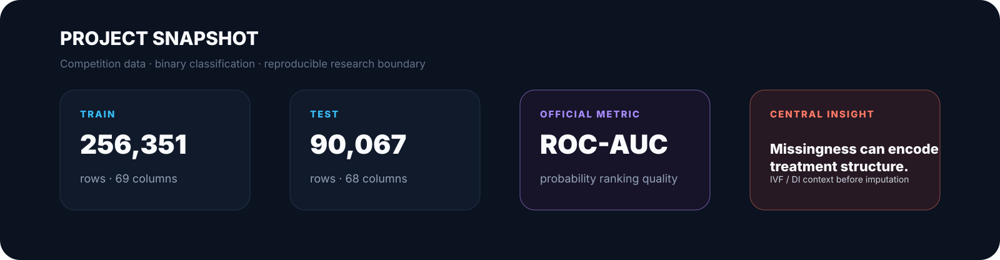
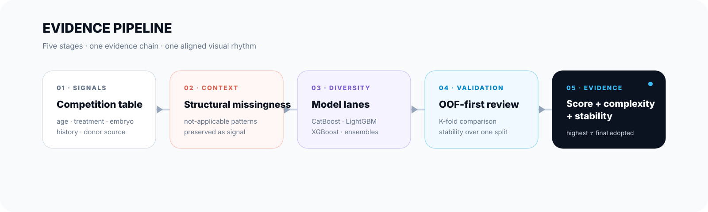
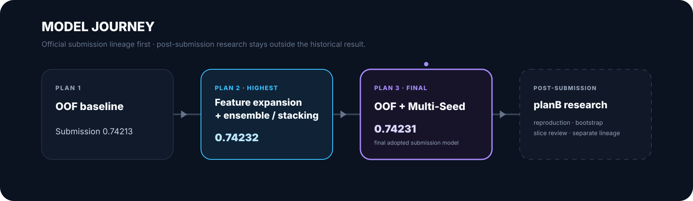
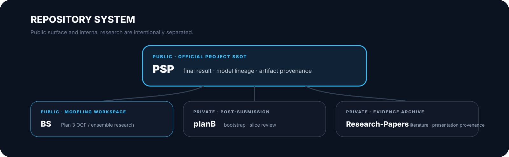
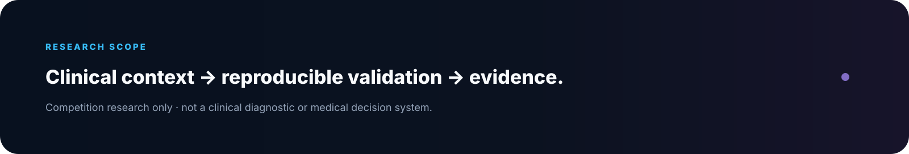

<picture><source media="(max-width:640px) and (prefers-color-scheme:dark)" srcset="./assets/hero-mobile.svg"><source media="(max-width:640px) and (prefers-color-scheme:light)" srcset="./assets/hero-light-mobile.svg"><source media="(prefers-color-scheme:dark)" srcset="./assets/hero.svg"><source media="(prefers-color-scheme:light)" srcset="./assets/hero-light.svg"></picture>

<h1 align="center">난임걱정마삼조</h1>

  <strong>대회 제공 난임 시술 데이터 기반 임신 성공 여부 예측 연구</strong> 
  구조적 결측 · OOF 검증 · CatBoost / LightGBM / XGBoost · Ensemble

  LG Aimers 6기 Phase2 · <a href="https://dacon.io/competitions/official/236452">DACON 공식 대회</a> · ROC-AUC

## 30-Second Path

- **Understand** — 아래 **Project Snapshot → Evidence Pipeline**에서 문제와 접근법을 확인합니다.
- **Verify** — **[`PSP`](https://github.com/nanimnoworry/PSP)**에서 공식 결과, model lineage, artifact provenance를 확인합니다.
- **Deep dive** — **[`BS`](https://github.com/nanimnoworry/BS)**에서 5-Fold OOF와 Weighted / Rank Ensemble 근거를 확인합니다.

`planB`와 `Research-Papers`는 후속 연구와 문헌·발표 근거를 보존하는 내부 저장소이며, **공개 결과의 기준점은 PSP**입니다.

## Project Snapshot

<picture>
  <source media="(max-width: 640px)" srcset="./assets/project-snapshot-mobile.svg" />
  
</picture>

핵심 아이디어는 결측을 일괄적인 누락으로 처리하지 않고 **IVF / DI 등 시술 맥락에 따른 구조적 비해당 가능성**을 먼저 검토한 뒤 모델링한 것입니다.

## Evidence Pipeline

<picture>
  <source media="(max-width: 640px)" srcset="./assets/evidence-pipeline-mobile.svg" />
  
</picture>

Clinical signals를 structural context로 해석하고, CatBoost · LightGBM · XGBoost의 model diversity와 K-Fold OOF를 거쳐 evidence를 비교했습니다. Weighted · Rank · Multi-Seed · Stacking은 같은 검증 계약 안에서만 해석합니다.

## Model Journey

<picture>
  <source media="(max-width: 640px)" srcset="./assets/model-lineage-mobile.svg" />
  
</picture>

공식 발표 기준 **최고 제출 AUC는 2안 `0.74232`**, **최종 채택 submission model은 3안 `0.74231`**입니다. 3안 채택에는 모델 복잡도, 검증 부담, seed 변동성, 추론 비용과 운영 단순성도 함께 고려되었습니다.

<strong>실험안별 발표 기준 수치</strong>

| 실험안 | 전략 | 내부 OOF AUC | 제출 AUC | 역할 |
|---|---|---:|---:|---|
| 1안 | boosting 비교 + OOF ensemble | ≈ `0.74058` | `0.74213` | 기초 성능 수립 |
| 2안 | feature 확장 + weighted / stacking | ≈ `0.74088` | **`0.74232`** | 최고 제출 점수 |
| 3안 | OOF + Multi-Seed | ≈ `0.74060` | `0.74231` | **최종 채택 submission model** |

> 실험안별 split · seed · 전처리 조건이 달라 OOF의 미세 차이를 직접 순위화하지 않습니다.

## Repository System

<picture>
  <source media="(max-width: 640px)" srcset="./assets/repository-map-mobile.svg" />
  
</picture>

- **[`PSP`](https://github.com/nanimnoworry/PSP)** — official project SSOT · 최종 결과 · lineage · provenance
- **[`BS`](https://github.com/nanimnoworry/BS)** — Plan 3 연계 OOF / ensemble research workspace

<strong>Internal lineage & public data boundary</strong>

- `planB` *(private)* — 공식 제출 이후 재현 · bootstrap · slice 검증 · 후속 모델 연구
- `Research-Papers` *(private)* — 임상·문헌 근거 · 발표자료 provenance
- Canonical final artifact identity는 [PSP final submission manifest](https://github.com/nanimnoworry/PSP/blob/main/deliverables/final_submission/MANIFEST.md)의 hash를 기준으로 합니다.
- 대회 원본 `train.csv` / `test.csv`는 public repository에 포함하지 않으며, Notebook sanitation provenance는 [이 기록](https://github.com/nanimnoworry/PSP/blob/main/docs/PUBLIC_NOTEBOOK_SANITIZATION.md)에 보존합니다.

## Team

**PSP public Git contributor record (2026-08-15):** [@emotigom](https://github.com/emotigom) · [@J36-Ai-Editer](https://github.com/J36-Ai-Editer) · [@UrungE](https://github.com/UrungE)  
세부 기준은 [PSP CONTRIBUTORS.md](https://github.com/nanimnoworry/PSP/blob/main/CONTRIBUTORS.md)를 따릅니다.

## Research Scope

<picture>
  <source media="(max-width: 640px)" srcset="./assets/footer-endcap-mobile.svg" />
  
</picture>

**Scope boundary:** 해커톤·연구 결과이며 실제 의료 환경의 임상 검증, 진단 또는 의사결정 성능을 주장하지 않습니다. **not a clinical diagnostic or medical decision system.**

---

### License and Rights

**Public view · no public reuse license.** Organization 문구·시각 자산과 repository-authored material은 별도 허가 없는 재사용·재배포를 허용하지 않습니다.

[LICENSE](../LICENSE) · [RIGHTS.md](../RIGHTS.md) · [CONTRIBUTORS.md](../CONTRIBUTORS.md)
