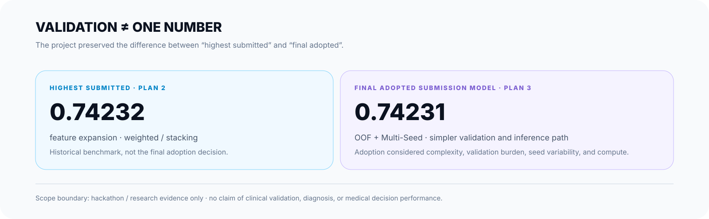

<picture>
  <source media="(max-width: 640px)" srcset="./assets/hero-mobile.svg" />
  
</picture>

<h1 align="center">난임걱정마삼조</h1>

  <strong>대회 제공 난임 시술 데이터 기반 임신 성공 여부 예측 연구</strong> 
  구조적 결측 · OOF 검증 · CatBoost / LightGBM / XGBoost · Ensemble

  LG Aimers 6기 Phase2 · <a href="https://dacon.io/competitions/official/236452">DACON 공식 대회</a> · ROC-AUC

## 30-Second Path

**10초 — 프로젝트 이해:** 아래 **Project Snapshot → Evidence Pipeline**만 보면 문제와 접근법을 파악할 수 있습니다.

**20초 — 공식 결과 확인:** **[`PSP`](https://github.com/nanimnoworry/PSP)**에서 최고 제출 점수, 최종 채택 모델, artifact provenance를 확인하세요.

**Deep dive — 모델링 근거:** **[`BS`](https://github.com/nanimnoworry/BS)**에서 CatBoost / LightGBM / XGBoost의 5-Fold OOF와 Weighted / Rank Ensemble을 확인하세요.

`planB`와 `Research-Papers`는 각각 후속 연구와 문헌·발표 근거를 보존하는 내부 저장소이며, **공개 결과의 기준점은 PSP**입니다.

## Project Snapshot

<picture>
  <source media="(max-width: 640px)" srcset="./assets/project-snapshot-mobile.svg" />
  
</picture>

이 프로젝트의 핵심은 결측을 일괄적인 누락으로 처리하지 않고 **IVF / DI 등 시술 맥락에 따른 구조적 비해당 가능성**을 먼저 검토한 뒤 모델링했다는 점입니다.

## Evidence Pipeline

<picture>
  <source media="(max-width: 640px)" srcset="./assets/evidence-pipeline-mobile.svg" />
  
</picture>

- **Clinical signals** — 연령 · 시술 유형 · 난자/배아/이식 정보 · 기증자 정보 · 과거 시술 이력
- **Structural context** — 시술 과정 차이에 따른 결측 의미 분리와 missing indicator
- **Model diversity** — CatBoost · LightGBM · XGBoost · Weighted / Rank / Multi-Seed / Stacking
- **OOF-first validation** — K-Fold OOF를 중심으로 split·seed·전처리 조건을 함께 기록

## Model Journey

<picture>
  <source media="(max-width: 640px)" srcset="./assets/model-lineage-mobile.svg" />
  
</picture>

공식 발표 기준 **최고 제출 AUC는 2안 `0.74232`**, **최종 채택 submission model은 3안 `0.74231`**입니다. 두 값은 의도적으로 분리해 기록합니다.

## Validation & Decision

<picture>
  <source media="(max-width: 640px)" srcset="./assets/validation-evidence-mobile.svg" />
  
</picture>

3안 채택에는 제출 점수만이 아니라 모델 복잡도, 검증 부담, seed 변동성, 추론 비용과 운영 단순성이 함께 고려되었습니다.

<strong>실험안별 발표 기준 수치 보기</strong>

| 실험안 | 전략 | 내부 OOF AUC | 제출 AUC | 역할 |
|---|---|---:|---:|---|
| 1안 | boosting 비교 + OOF ensemble | ≈ `0.74058` | `0.74213` | 기초 성능 수립 |
| 2안 | feature 확장 + weighted / stacking | ≈ `0.74088` | **`0.74232`** | 최고 제출 점수 |
| 3안 | OOF + Multi-Seed | ≈ `0.74060` | `0.74231` | **최종 채택 submission model** |

> OOF 수치는 실험안별 split · seed · 전처리 조건이 달라 미세 차이를 직접 순위화하지 않습니다.

## Repository System

<picture>
  <source media="(max-width: 640px)" srcset="./assets/repository-map-mobile.svg" />
  
</picture>

| Repository | Visibility | 역할 |
|---|---|---|
| **[`PSP`](https://github.com/nanimnoworry/PSP)** | Public | 공식 프로젝트 SSOT · 최종 결과 · lineage · provenance |
| [`BS`](https://github.com/nanimnoworry/BS) | Public | 3안 연계 OOF / ensemble 연구 workspace |
| `planB` | Private | 공식 제출 이후 재현 · bootstrap · slice 검증 · 후속 모델 연구 |
| `Research-Papers` | Private | 임상·문헌 근거 · 발표자료 provenance |

## Team

**PSP public Git contributor record (2026-08-15):**  
[@emotigom](https://github.com/emotigom) · [@J36-Ai-Editer](https://github.com/J36-Ai-Editer) · [@UrungE](https://github.com/UrungE)

이 목록은 공개 Git 활동을 식별하기 위한 것이며 기여도 순위나 단독 소유권을 의미하지 않습니다. 세부 기준은 [`PSP/CONTRIBUTORS.md`](https://github.com/nanimnoworry/PSP/blob/main/CONTRIBUTORS.md)를 따릅니다.

<strong>Artifact provenance & public data boundary</strong>

- 공식 제출 Notebook·발표자료의 canonical identity는 [`PSP/deliverables/final_submission/MANIFEST.md`](https://github.com/nanimnoworry/PSP/blob/main/deliverables/final_submission/MANIFEST.md)의 hash 기록을 기준으로 합니다.
- 대회 원본 `train.csv` / `test.csv`는 public repository에 포함하지 않습니다.
- public Notebook은 code-cell output과 execution count를 제거한 상태로 관리하며, provenance는 [`PUBLIC_NOTEBOOK_SANITIZATION.md`](https://github.com/nanimnoworry/PSP/blob/main/docs/PUBLIC_NOTEBOOK_SANITIZATION.md)에 기록합니다.
- post-submission 연구 결과는 공식 제출·발표 계보를 소급해 변경하지 않습니다.

## Research Scope

<picture>
  <source media="(max-width: 640px)" srcset="./assets/footer-endcap-mobile.svg" />
  
</picture>

**Scope boundary:** 해커톤·연구 결과이며 실제 의료 환경의 임상 검증, 진단 또는 의사결정 성능을 주장하지 않습니다. In short: **not a clinical diagnostic or medical decision system.**

---

### License and Rights

**Public view · no public reuse license.**  
Organization 문구·시각 자산과 repository-authored material은 별도 허가 없는 재사용·재배포를 허용하지 않으며, 대회 데이터·제3자 자료·라이브러리·문헌은 각 권리와 조건을 따릅니다.

[LICENSE](../LICENSE) · [RIGHTS.md](../RIGHTS.md) · [CONTRIBUTORS.md](../CONTRIBUTORS.md)
